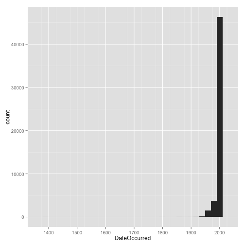
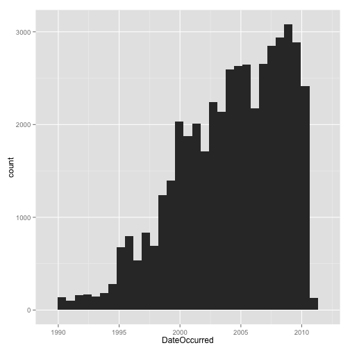
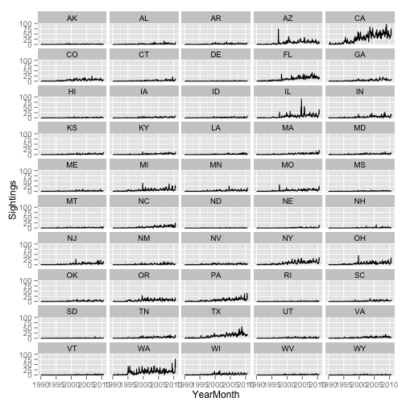

#ML_forHackers_CH1

Research question: What, if any, seasonal variation exists for UFO sightings in US states? 


```r
setwd('/Users/kseidl/Documents/OReilly/ML_for_Hackers/01-Introduction/data/ufo/')
library(ggplot2) #load ggplot2 library
library(plyr)
```

## Loading the dataset 

```r
ufo <- read.delim("ufo_awesome.tsv", sep = "\t", stringsAsFactors = FALSE, header = FALSE, na.strings = "")
```

## Cleaning the dataset


```r
## give meaningful names to the columns
names(ufo) <- c("DateOccurred", "DateReported", "Location", "ShortDescription", "Duration", "LongDescription")
```


```r
## convert dates to Date data type
good.rows <- ifelse(nchar(ufo$DateOccurred) !=8 | nchar(ufo$DateReported) != 8, FALSE, TRUE) 
ufo <- ufo[good.rows, ]
ufo$DateOccurred <- as.Date(ufo$DateOccurred, format = '%Y%m%d')
ufo$DateReported <- as.Date(ufo$DateReported, format = '%Y%m%d')
```


```r
## organizing location data

get.location <- function(l) { #define function get.location for cleaning location data
        split.location <- tryCatch(strsplit(l, ",")[[1]], error = function(e) return(c(NA,NA))) #split location entry at the ,
        clean.location <- gsub("^ ", "", split.location) #get rid of leading white space
        if (length(clean.location) > 2) { #make sure that clean.location only contains two entries (city, state)
                return(c(NA, NA))      
        }
        else {
                return(clean.location)
        }
}

#apply get.location to each row in ufo dataset.
city.state <- lapply(ufo$Location, get.location)  #city.state is a list 
```


```r
#convert get.location to matrix format
location.matrix <- do.call(rbind, city.state)

#add location.matrix to ufo dataframe
ufo <- transform(ufo, USCity = location.matrix[,1], USState = tolower(location.matrix[,2]), stringsAsFactors = FALSE)
```


```r
#replace non-US entries with NA
us.states <- c("ak", "al", "ar", "az", "ca", "co", "ct", "de", "fl", "ga", "hi", "ia", "id", "il", "in", "ks", "ky", "la", 
               "ma", "md", "me", "mi", "mn", "mo", "ms", "mt", "nc", "nd", "ne", "nh", "nj", "nm", "nv", "ny", "oh", "ok", 
               "or", "pa", "ri", "sc", "sd", "tn", "tx", "ut", "va", "vt", "wa", "wi", "wv", "wy") 

ufo$USState <- us.states[match(ufo$USState, us.states)]
ufo$USCity[is.na(ufo$USState)] <- NA 
```


```r
## reduce ufo dataset to only US entries
ufo.us <- subset(ufo, !is.na(ufo$USState))
(nrow(ufo.us))
```

```
## [1] 51641
```

```r
head(ufo.us)
```

```
##   DateOccurred DateReported              Location ShortDescription
## 1   1995-10-09   1995-10-09         Iowa City, IA             <NA>
## 2   1995-10-10   1995-10-11         Milwaukee, WI             <NA>
## 3   1995-01-01   1995-01-03           Shelton, WA             <NA>
## 4   1995-05-10   1995-05-10          Columbia, MO             <NA>
## 5   1995-06-11   1995-06-14           Seattle, WA             <NA>
## 6   1995-10-25   1995-10-24  Brunswick County, ND             <NA>
##   Duration
## 1     <NA>
## 2   2 min.
## 3     <NA>
## 4   2 min.
## 5     <NA>
## 6  30 min.
##                                                                                                                                                                           LongDescription
## 1                                          Man repts. witnessing &quot;flash, followed by a classic UFO, w/ a tailfin at back.&quot; Red color on top half of tailfin. Became triangular.
## 2                                                       Man  on Hwy 43 SW of Milwaukee sees large, bright blue light streak by his car, descend, turn, cross road ahead, strobe. Bizarre!
## 3 Telephoned Report:CA woman visiting daughter witness discs and triangular ships over Squaxin Island in Puget Sound. Dramatic.  Written report, with illustrations, submitted to NUFORC.
## 4                                                    Man repts. son&apos;s bizarre sighting of small humanoid creature in back yard.  Reptd. in Acteon Journal, St. Louis UFO newsletter.
## 5                                                            Anonymous caller repts. sighting 4 ufo&apos;s in NNE sky, 45 deg. above horizon.  (No other facts reptd.  No return tel. #.)
## 6                                                      Sheriff&apos;s office calls to rept. that deputy, 20 mi. SSE of Wilmington,  is looking at peculiar, bright white, strobing light.
##             USCity USState
## 1        Iowa City      ia
## 2        Milwaukee      wi
## 3          Shelton      wa
## 4         Columbia      mo
## 5          Seattle      wa
## 6 Brunswick County      nd
```

## Initial Analysis


```r
# Summarize date information
(summary(ufo$DateOccurred))
```

```
##         Min.      1st Qu.       Median         Mean      3rd Qu. 
## "1400-06-30" "1999-09-15" "2003-12-15" "2001-02-10" "2007-06-21" 
##         Max.         NA's 
## "2010-08-30"          "2"
```


```r
# Quick histogram
quick.hist <- ggplot(ufo.us, aes(x = DateOccurred)) + geom_histogram() + scale_x_date(minor_breaks = "50 years")
print(quick.hist)
```

```
## stat_bin: binwidth defaulted to range/30. Use 'binwidth = x' to adjust this.
```

 
The majority of data lie between 1960 and 2010. We will subset the data to contain only entries that were made after 1990; 


```r
ufo.us <- subset(ufo.us, DateOccurred >= as.Date("1990-01-01"))
(nrow(ufo.us))
```

```
## [1] 46347
```

```r
head(ufo.us)
```

```
##   DateOccurred DateReported              Location ShortDescription
## 1   1995-10-09   1995-10-09         Iowa City, IA             <NA>
## 2   1995-10-10   1995-10-11         Milwaukee, WI             <NA>
## 3   1995-01-01   1995-01-03           Shelton, WA             <NA>
## 4   1995-05-10   1995-05-10          Columbia, MO             <NA>
## 5   1995-06-11   1995-06-14           Seattle, WA             <NA>
## 6   1995-10-25   1995-10-24  Brunswick County, ND             <NA>
##   Duration
## 1     <NA>
## 2   2 min.
## 3     <NA>
## 4   2 min.
## 5     <NA>
## 6  30 min.
##                                                                                                                                                                           LongDescription
## 1                                          Man repts. witnessing &quot;flash, followed by a classic UFO, w/ a tailfin at back.&quot; Red color on top half of tailfin. Became triangular.
## 2                                                       Man  on Hwy 43 SW of Milwaukee sees large, bright blue light streak by his car, descend, turn, cross road ahead, strobe. Bizarre!
## 3 Telephoned Report:CA woman visiting daughter witness discs and triangular ships over Squaxin Island in Puget Sound. Dramatic.  Written report, with illustrations, submitted to NUFORC.
## 4                                                    Man repts. son&apos;s bizarre sighting of small humanoid creature in back yard.  Reptd. in Acteon Journal, St. Louis UFO newsletter.
## 5                                                            Anonymous caller repts. sighting 4 ufo&apos;s in NNE sky, 45 deg. above horizon.  (No other facts reptd.  No return tel. #.)
## 6                                                      Sheriff&apos;s office calls to rept. that deputy, 20 mi. SSE of Wilmington,  is looking at peculiar, bright white, strobing light.
##             USCity USState
## 1        Iowa City      ia
## 2        Milwaukee      wi
## 3          Shelton      wa
## 4         Columbia      mo
## 5          Seattle      wa
## 6 Brunswick County      nd
```

Create a new histogram with the reduced dataset. 


```r
quick.hist <- ggplot(ufo.us, aes(x = DateOccurred)) + geom_histogram()
print(quick.hist)
```

```
## stat_bin: binwidth defaulted to range/30. Use 'binwidth = x' to adjust this.
```

 


```r
ufo.us$YearMonth <- strftime(ufo.us$DateOccurred, format = "%Y-%m")
```


```r
sightings.counts <- ddply(ufo.us, .(USState, YearMonth), nrow)
head(sightings.counts)
```

```
##   USState YearMonth V1
## 1      ak   1990-01  1
## 2      ak   1990-03  1
## 3      ak   1990-05  1
## 4      ak   1993-11  1
## 5      ak   1994-11  1
## 6      ak   1995-01  1
```


```r
date.range <- seq.Date(from = as.Date(min(ufo.us$DateOccurred)), to = as.Date(max(ufo.us$DateOccurred)), by = "month")

date.strings <- strftime(date.range, "%Y-%m")
states.dates <- lapply(us.states, function(s) cbind(s, date.strings))
states.dates <- data.frame(do.call(rbind, states.dates), stringsAsFactors=FALSE)

all.sightings <- merge(states.dates, sightings.counts, by.x = c("s", "date.strings"), by.y = c("USState", "YearMonth"), all = TRUE)

names(all.sightings) <- c("State", "YearMonth", "Sightings")
all.sightings$Sightings[is.na(all.sightings$Sightings)] <- 0
all.sightings$YearMonth <- as.Date(rep(date.range, length(us.states)))
all.sightings$State <- as.factor(toupper(all.sightings$State))
```


```r
state.plot <- ggplot(all.sightings, aes(x = YearMonth, y = Sightings)) + 
        geom_line()+
        facet_wrap(~State, nrow = 10, ncol = 5)
print(state.plot)
```

 
